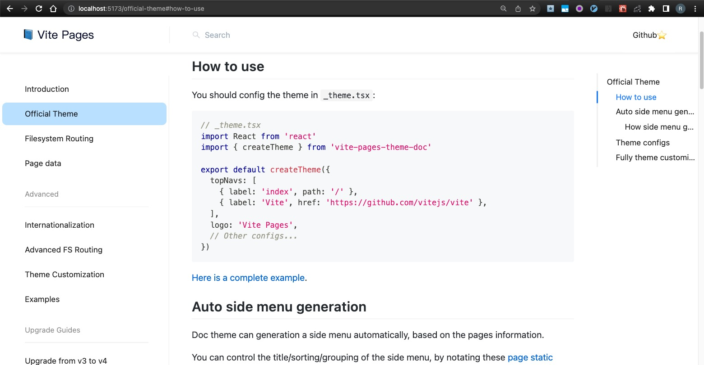

# Upgrade from v3 to v4

vite-pages v4 is released with following improvements:

- Support [Vite v4](https://vitejs.dev/guide/migration.html).
- Upgrade React to [18.x](https://reactjs.org/blog/2022/03/08/react-18-upgrade-guide.html).
- Upgrade react-router to [6.x](https://reactrouter.com/en/main/upgrading/v5).
- Upgrade mdx to [2.x](https://mdxjs.com/migrating/v2/).
- Upgrade antd to [5.x](https://ant.design/docs/react/migration-v5) (for vite-pages-theme-doc).
- Support [Node.js ECMAScript modules](https://nodejs.org/api/esm.html).
- Support markdown outline (table of content).
- Support search.



The following article will show you the migrate instructions. If you encounter problems, open an issue in the repo. Or checkout the [getting-stated templates](https://vitejs.github.io/vite-plugin-react-pages/#getting-stated) for reference.

## Upstream libraries migration

Most upgrade work for upstream libraries is already done inside `vite-plugin-react-pages` and `vite-pages-theme-doc`. But some migration need to be done in userland, if you are using some old APIs that are dropped by these upstream libraries. For example, you can no longer use `<Switch>` of `react-router`. Checkout the links above for the migration guides of upstream libraries.

We expect upstream libraries migration to be very easy for framwork users, unless you used many `react-router` v5-only APIs.

## Buildin mdx plugin

Due to the upgrade to mdx v2, vite-pages now includes a builtin mdx plugin. So you should remove the `vite-plugin-mdx` in vite-pages v5.

```diff
import { defineConfig } from 'vite'
import react from '@vitejs/plugin-react'
- import mdx from 'vite-plugin-mdx'
import pages from 'vite-plugin-react-pages'

export default defineConfig({
  plugins: [
    react(),
-   mdx(),
    pages()
  ],
})
```

Notice that `pages()` now return an array of vite plugins. But vite can notice that and apply every plugin in that array. So the invoke pattern of `vite-plugin-react-pages` looks exactly the same as before! You don't need to apply the new builtin mdx plugin manually.

## Use Node.js ECMAScript modules

The Node.js community is quickly migrating from CommonJS to ECMAScript modules (esm). And we encourage you to run vite on the esm mode of Node.js.

How to enable esm for Node.js? Just add a `"type": "module"` field to the `package.json` of your vite project!

> It is encouraged to have a dedicated `package.json` for your vite project. Your vite project should not share a `package.json` with the npm package that you are publishing (or the worspace package in the project root directory, if you are using monorepo).
